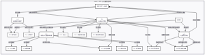

# Servlet-JSP based Meeting Room Booking-System
---
随着企业规模的扩大，传统的人工会议室预约方式效率低下、容错率低，需要较多的人力物力成本，且较为难以管理，已难以满足高效管理的需求 ；相比之下，以计算机技术为基础的企业会议室预约系统高效、有序，易于管理，已经成为企业管理会议室使用的首选。

本项目旨在开发一个基于Servlet+JSP的会议室预约管理系统，实现会议室的**在线预约、冲突检测、审批管理**等功能，使企业员工能够足不出户查询和预约会议室，提高会议室利用率并节省组织者时间 。

### **you can find the details in [notion website](https://emerald-hail-e72.notion.site/20b6eca002f280b9befdd8f38e7ef38f?pvs=74)**
### written by shepherd&invictus.
#### @Kyochilian All Rights Reserved.
